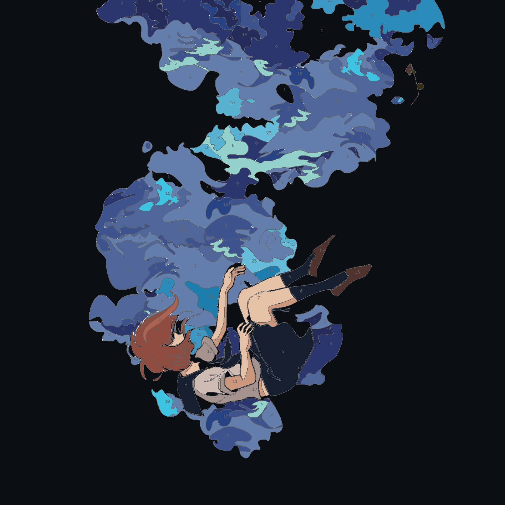
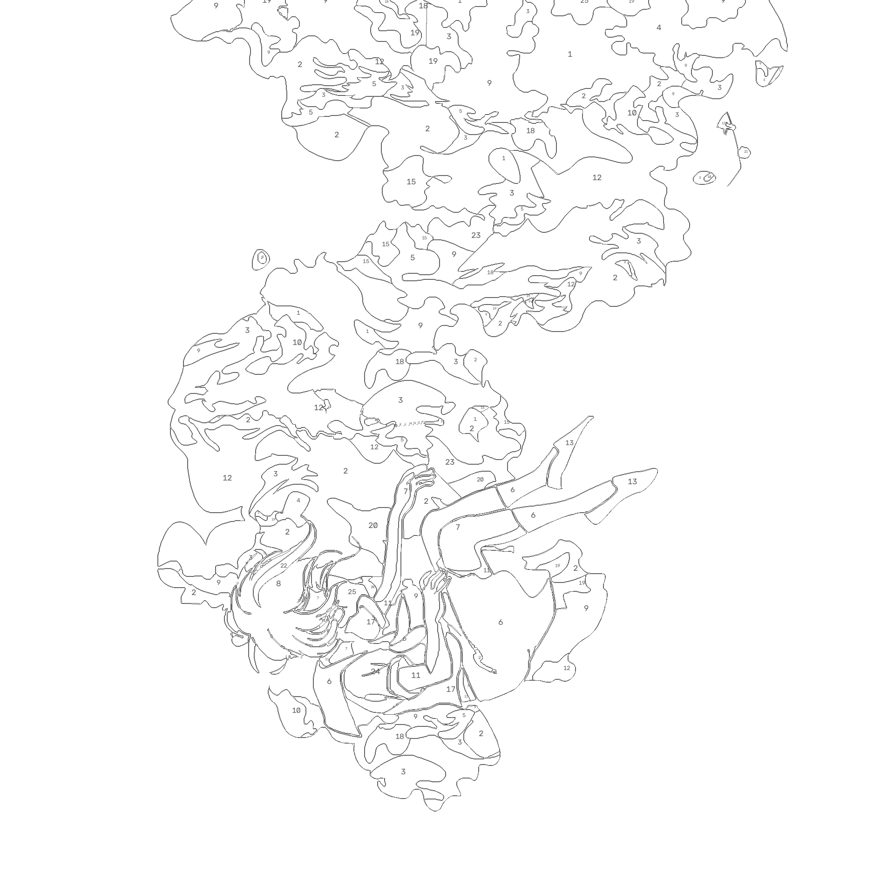

# Paint-by-Numbers Generator

Turn any photo into a printable paint-by-numbers coloring book. Upload an image, tweak the settings, and get a vector PDF with numbered regions, color palette, and crisp outlines.

## Screenshots

| Colored Preview | Outline Only | PDF Output |
|---|---|---|
|  |  | [Download PDF](samples/example_output.pdf) |

## Features

- **Color quantization** — k-means clustering → smart merge of similar colors with controllable threshold
- **Region segmentation** — Felzenszwalb superpixels → RAG merge → contour extraction with RETR_CCOMP (exterior + holes)
- **Contour smoothing** — TC89_KCOS approximation + Chaikin corner-cutting for clean vector paths (holes only)
- **Corner preservation** — exterior contours use approxPolyDP only to prevent edge clipping
- **Vector PDF** — ReportLab rendering with outline-only stroke, palette legend, and region labels
- **Liquid Glass UI** — frosted glass dark theme with backdrop blur and glow effects
- **Configurable** — detail level, palette size, color merge threshold, line thickness, paper size & orientation

## Quick Start

```powershell
python -m venv .venv
.\.venv\Scripts\Activate.ps1
pip install -r requirements.txt
uvicorn app.main:app --reload
```

Open `http://localhost:8000`, upload an image, adjust parameters, and click **Generate**.

## API

| Method | Path | Description |
|--------|------|-------------|
| GET | `/` | Web UI |
| GET | `/api/health` | Health check |
| POST | `/api/convert` | Upload image → JSON with colored PNG, outline PNG, and PDF (base64 data URIs) |

### POST `/api/convert` Parameters

| Param | Type | Default | Range | Description |
|---|---|---|---|---|
| `image` | file | — | PNG/JPEG/WebP | Input image (max 25 MB) |
| `detail_level` | int | 5 | 1–15 | Higher = smaller regions, more detail |
| `max_colors` | int | 64 | 2–64 | Maximum palette size |
| `color_merge_threshold` | float | 15 | 0–100 | Merge similar colors. 0 = off |
| `line_thickness` | float | 1.0 | 0.5–3.0 | Outline stroke width |
| `paper_size` | str | A4 | A3/A4/A5/Letter/Legal | Output page size |
| `orientation` | str | auto | auto/portrait/landscape | Page orientation |
| `show_numbers` | bool | true | — | Show region number labels |
| `number_color` | str | black | black/gray | Label and outline color |

## Tests

```powershell
python -m pytest -q --tb=short
```

53 tests covering: pipeline integration, region extraction, contour geometry, color merging, PDF layout, and full API round-trip.

## Project Structure

```
app/
  main.py            — FastAPI server & routes
  pipeline.py         — full conversion pipeline
  models.py           — Pydantic params, dataclasses (Region, PaletteColor, RenderData)
  config.py           — paper sizes, thresholds
  quantize.py         — k-means quantization + merge_similar_colors
  regions.py          — contour extraction (RETR_CCOMP, TC89_KCOS, Chaikin)
  postprocess.py      — RAG merge, label boundary smoothing, Chaikin/adaptive smoothing
  pdf_layout.py       — ReportLab PDF rendering
  visualize.py        — OpenCV preview rendering
static/
  index.html, app.js, styles.css — Liquid Glass UI
samples/
  example_colored.png  — colored preview
  example_outline.png  — outline-only preview
  example_output.pdf   — printable PDF
tests/
  conftest.py          — test fixtures (two-color synthetic images)
  test_pipeline.py
  test_regions.py
  test_quantize.py
  test_postprocess.py
  test_pdf_layout.py
  test_api.py
  test_models.py
  test_config.py
```

## Pipeline

1. Resize to `max_working_side` (detail-level dependent)
2. `pyrMeanShiftFilter` → CLAHE → unsharp masking (noise reduction)
3. Felzenszwalb segmentation → flatten to mean color
4. k-means quantization → `merge_similar_colors` (dedup + merge close colors)
5. RAG merge of small regions + adaptive `smooth_label_boundaries`
6. Per-label `MORPH_OPEN` (detail-level dependent)
7. `extract_regions` — RETR_CCOMP hierarchy, TC89_KCOS, approxPolyDP (exterior) + Chaikin (holes), pole-of-inaccessibility centroids
8. `render_pdf` — single-pass outlines + palette legend + letter labels for tiny regions
